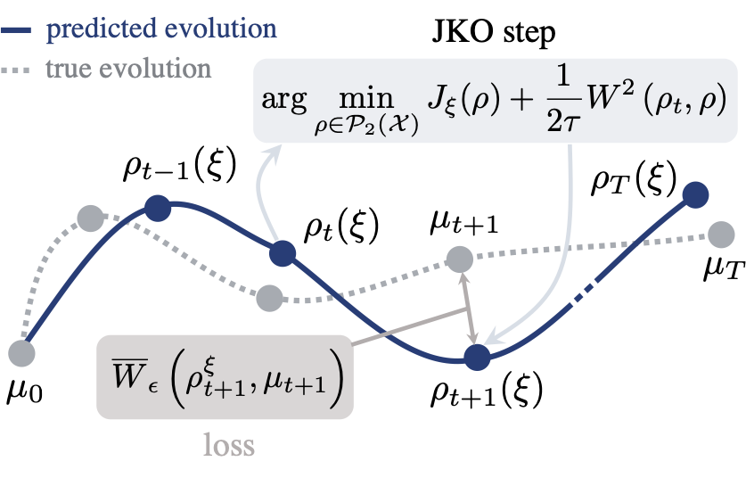

# [Proximal Optimal Transport Modeling of Population Dynamics](https://arxiv.org/pdf/2106.06345.pdf)

Published at [AISTATS 2022](https://arxiv.org/pdf/2106.06345.pdf).

We propose a new approach to model the collective dynamics of a population of particles evolving with time. As is often the case in challenging scientific applications, notably single-cell genomics, measuring features for these particles requires destroying them. As a result, the population can only be monitored with periodic snapshots, obtained by sampling a few particles that are sacrificed in exchange for measurements. 

Given only access to these snapshots, can we reconstruct likely individual trajectories for all other particles? We propose to model these trajectories as collective realizations of a causal JordanKinderlehrer-Otto (JKO) flow of measures: The JKO scheme posits that the new configuration taken by a population at time $t + 1$ is one that trades off an improvement, in the sense that it decreases an energy, while remaining close (in Wasserstein distance) to the previous configuration observed at $t$. In order to learn such an energy $J_\xi$ using only snapshots, we propose $\text{JKOnet}$, a neural architecture that computes (in end-to-end differentiable fashion) the JKO flow given a parametric energy and initial configuration of points. 

<p align='center'> </p>

## Installation

To install all dependencies, execute the following steps:
```
conda create --name jko python=3.9.7
conda activate jko

conda update -n base -c defaults conda

pip install -r requirements.txt
python setup.py develop
```
In case you do not use miniconda, make sure to use the right versions of the libraries
specified in the `requirements` file.

If you work on GPUs, please download `jax` with CUDA support (see [here](https://github.com/google/jax#installation)).

If you want jupyter notebook support (may have errors), run the following 
commands (inside `jko`):
```
conda install -c anaconda ipykernel
python -m ipykernel install --user --name=jko
```
Change the kernel name to `jko` or create a new ipython notebook using `jko` 
as the kernel.

## Run Experiments

The experiments are executed via the `main.py` file. Please specify:
- `--outdir`: the directory in which the results are stored
- `--config_folder`: the folder containing the config files
- `--task`: the task for which you would like to learn $\text{JKOnet}$

Besides, you can execute the script in the debug mode in which the module is not jit-compiled via the `--debug` flag. To log your results via [`wandb`](https://wandb.ai/), execute the script with the `--wandb` flag. You can specify the experiment group via `--exp_group`.

We provide code for the following tasks:
- potential-based dynamics: `quadratic` and `styblinski`
- trajectory-based dynamics: `line`, `semicircle`, and `spiral`

In the following, we provide an example on how to run $\text{JKOnet}$ on the semicircle task:
```
python main.py --out_dir results --config_folder configs --task semicircle
```

## Citation

In case you found our work useful, please consider citing us:

```
@inproceedings{bunne2022proximal,
    title={{Proximal Optimal Transport Modeling of Population Dynamics}},
    author={Bunne, Charlotte and Meng-Papaxanthos, Laetitia and Krause, Andreas and Cuturi, Marco},
    booktitle={International Conference on Artificial Intelligence and Statistics (AISTATS)},
    year={2022},
    volume={25}
}
```

## Contact
In case you have questions, reach out to `bunnec@ethz.ch`.
